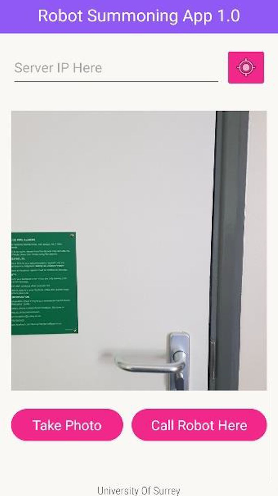

# msc-dissertation

code and files supporting my MSc dissertation at University of Surrey: - 
a mobile application that allows users to summon a robot to their location by guessing it through a pose regression CNN

## Application Preview

## System Architecture

